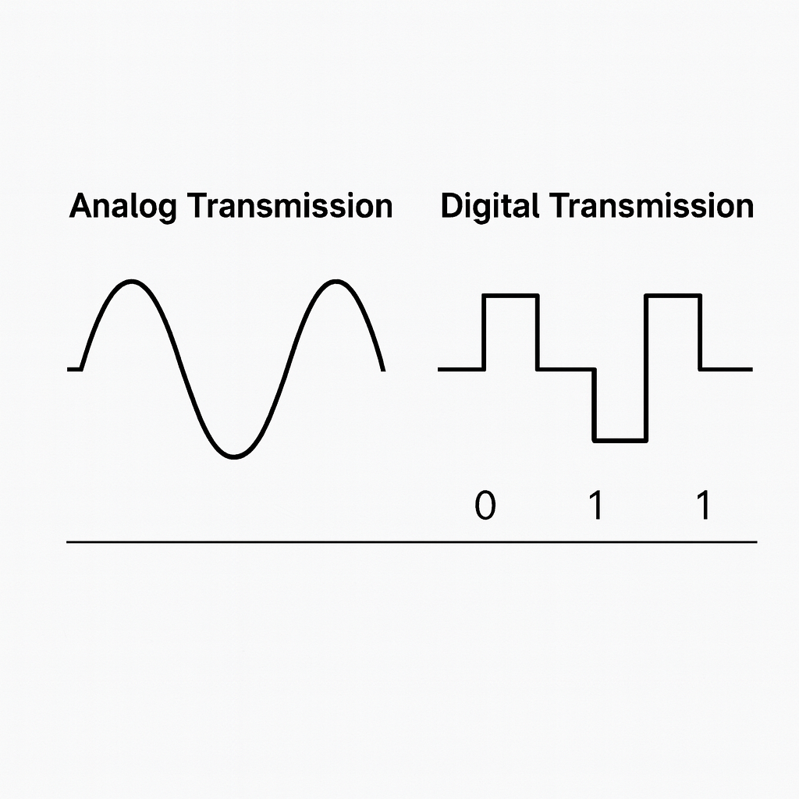

# Networking Basics & Key Terminology
~
## Written By: VINOD N. RATHOD.
~

## Transmission & Communication  

### Data Transmission: Analog vs. Digital  

---

### Analog Transmission  
- **Definition:** Data is sent as a continuous wave (signal) that changes smoothly over time.  
- **How it works:** The wave’s properties (amplitude, frequency, phase) are varied to represent information.  
- **Used in:** Traditional telephone lines, FM/AM radio, old TV broadcasting.  
- **Advantages:**  
  - Can carry voice and video naturally (since human voice is analog).  
  - Simple technology, used for decades.  
- **Disadvantages:**  
  - Prone to noise and distortion (signals lose quality over distance).  
  - Harder to encrypt and process by computers.  
- **Key Point:** Analog = Continuous signals, less accurate over long distances.  

---

### Digital Transmission  
- **Definition:** Data is sent as discrete signals (0s and 1s) — represented by voltage pulses (on/off).  
- **How it works:** Information is encoded into binary and transmitted as separate bits.  
- **Used in:** Modern computer networks, mobile communication, Wi-Fi, optical fiber, digital TV.  
- **Advantages:**  
  - Less affected by noise (clearer quality even over long distances).  
  - Easier to compress, encrypt, and process.  
  - More reliable for computers (which work in binary).  
- **Disadvantages:**  
  - Needs conversion (analog voice → digital signal).  
  - Requires more bandwidth than analog for some applications.  
- **Key Point:** Digital = Discrete signals (0/1), reliable and suited for modern networking.  

---

## Quick Comparison  
- **Analog Transmission** → Continuous wave, simple but easily affected by noise.  
- **Digital Transmission** → Binary (0s and 1s), reliable, secure, and used in today’s networks.  

---
# THANK YOU!  
# ~ **V1NNN22** ~
