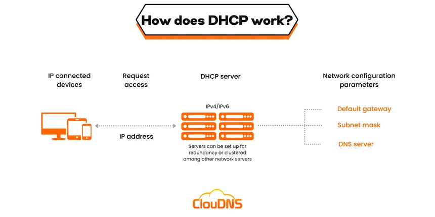

# DHCP (Dynamic Host Configuration Protocol)  
~
## Written By: VINOD N. RATHOD.  
~

---

## 📌 What is DHCP?  
- **Definition:** DHCP is a **network management protocol** used to automatically assign **IP addresses and other network configurations** to devices on a network.  
- **Purpose:**  
  - Reduces **manual IP configuration**.  
  - Prevents **IP conflicts**.  
  - Simplifies **network management**.  
- **Layer:** Operates at the **Application Layer** of the OSI model (but configures Network Layer parameters).  

---

## ⚙️ How DHCP Works (Process)  
1. **DHCP Discover** → Client broadcasts request for IP.  
2. **DHCP Offer** → DHCP server responds with available IP & configs.  
3. **DHCP Request** → Client requests offered IP from server.  
4. **DHCP Acknowledge (ACK)** → Server confirms & assigns IP to client.  

👉 Known as the **DORA process** *(Discover → Offer → Request → Acknowledge)*  

---

## 📡 DHCP Configuration Parameters  
- **IP Address** (assigned to client)  
- **Subnet Mask** (defines network/host portion)  
- **Default Gateway** (router address)  
- **DNS Servers** (domain name resolution)  
- **Lease Time** (validity of the IP assignment)  

---

## ✅ Advantages of DHCP  
- Centralized management of IP addresses.  
- Saves admin time and reduces errors.  
- Reuses IP addresses efficiently.  
- Scales easily for large networks.  

## ❌ Disadvantages of DHCP  
- If the **DHCP server fails** → devices may not get IPs.  
- Broadcast traffic increases during discovery.  
- Less control compared to static IP assignment.  

---

## 📤 Types of DHCP Messages  
- **DHCP Discover** → Client searching for server.  
- **DHCP Offer** → Server proposes IP & configs.  
- **DHCP Request** → Client accepts offer.  
- **DHCP Acknowledge (ACK)** → Final confirmation.  
- **DHCP NACK** → Server rejects request.  
- **DHCP Release** → Client releases IP when shutting down.  

---

## ⚡ Quick Recap (DHCP)  

| Concept       | Meaning |
|---------------|---------|
| **DHCP**      | Protocol to assign IPs dynamically |
| **DORA**      | Process of assigning IP (Discover → Offer → Request → ACK) |
| **Lease Time**| Time duration an IP is valid |
| **Advantage** | Automatic, reduces conflicts, scalable |
| **Disadvantage** | Server dependency, broadcast traffic |

---

---

# THANK YOU!  
# ~ **V1NNN22**
