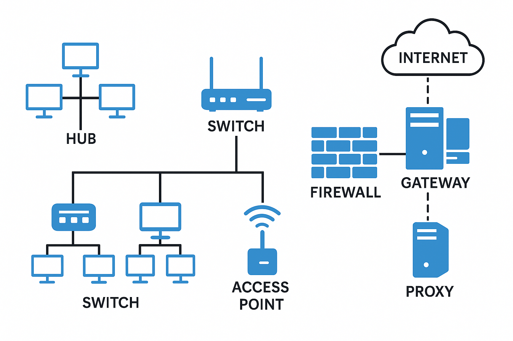

# Networking Basics & Key Terminology
~
## Written By: VINOD N. RATHOD.
~

## Network Devices: Hub, Switch, Router, Access Point, Firewall, Gateway, Proxy  

### 1. Hub  
- **Definition:** A basic device that connects multiple computers in a network.  
- **How it works:** Whatever data it receives from one device, it sends (broadcasts) to all other devices.  
- **Advantages:** Cheap and simple.  
- **Disadvantages:** Inefficient — causes unnecessary traffic.  
- **Key Point:** Hub = One message → sent to everyone (no intelligence).  

---

### 2. Switch  
- **Definition:** A smarter device that connects multiple computers in a LAN.  
- **How it works:** Sends data only to the device it is meant for (using MAC addresses).  
- **Advantages:** Faster and more efficient than a hub.  
- **Example:** Used in offices, schools, and data centers to connect PCs.  
- **Key Point:** Switch = One message → sent only to the correct device.  

---

### 3. Router  
- **Definition:** A device that connects different networks (e.g., your home network to the internet).  
- **How it works:** Uses IP addresses to decide the best path for data.  
- **Advantages:** Can connect multiple networks, provides internet access, often includes firewall/NAT features.  
- **Example:** Home Wi-Fi router connecting devices to the ISP.  
- **Key Point:** Router = Connects one network to another (LAN ↔ Internet).  

---

### 4. Access Point (AP)  
- **Definition:** A device that allows wireless devices to connect to a wired network.  
- **How it works:** Extends network coverage via Wi-Fi.  
- **Uses:** Offices, schools, public Wi-Fi hotspots.  
- **Key Point:** Access Point = Entry point for wireless devices into a wired network.  

---

### 5. Firewall  
- **Definition:** A security device (hardware or software) that monitors and controls network traffic.  
- **How it works:** Blocks or allows data based on security rules.  
- **Uses:** Protects against hackers, malware, and unauthorized access.  
- **Key Point:** Firewall = Security guard of the network.  

---

### 6. Gateway  
- **Definition:** A device that connects two networks that use different communication protocols.  
- **How it works:** Translates one protocol into another so the two networks can communicate.  
- **Example:** A gateway connecting a company’s internal system to the internet.  
- **Key Point:** Gateway = Translator between two different networks.  

---

### 7. Proxy Server  
- **Definition:** An intermediate server between a user and the internet.  
- **How it works:** The user sends requests to the proxy, and the proxy forwards them to the internet (and back).  
- **Advantages:**  
  - Hides the user’s identity (IP address).  
  - Can cache data to make browsing faster.  
  - Used for filtering or monitoring internet use.  
- **Key Point:** Proxy = Middleman between user and internet.  

---

---
## Quick Comparison  
- **Hub:** Basic, sends data to all → Inefficient.  
- **Switch:** Smarter, sends data to correct device → Efficient.  
- **Router:** Connects networks (LAN ↔ Internet).  
- **Access Point:** Wireless entry to a wired network.  
- **Firewall:** Monitors/blocks unsafe traffic → Security.  
- **Gateway:** Converts protocols → Translator.  
- **Proxy:** Middleman between user and internet.  

---
# THANK YOU!  
# ~ **V1NNN22** ~
