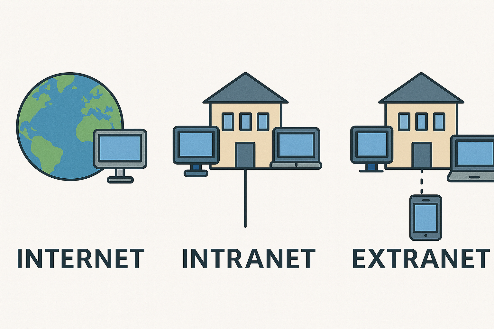

# Networking Basics & Key Terminology
~
## Written By: VINOD N. RATHOD. 
~

## Intranet vs. Internet vs. Extranet

### Internet
- The **global network** that connects millions of computers and devices worldwide.  
- Anyone can access it (with an internet connection).  
- **Examples:** Google, YouTube, Instagram, Online Shopping, Email.  
- **Key point:** Public, open to all, worldwide.  

---

### Intranet
- A **private network** for people inside an organization (company, school, university).  
- Used for **internal communication and resource sharing**.  
- **Examples:**
  - A company’s internal portal for employees (leave applications, salary info, documents).  
  - A school’s online portal for teachers and students.  
- **Key point:** Private, only for members of that organization.  

---

### Extranet
- A **controlled private network** with **limited access** to outsiders (partners, clients, vendors) along with internal staff.  
- Think of it as *Intranet + selective outside access*.  
- **Examples:**
  - A supplier logging into a company’s system to check order status.  
  - A university allowing parents to check student grades online.  
- **Key point:** Private, but allows limited outside access.  

---

---

## Quick! 
- **Internet** → Open to **everyone** (global).  
- **Intranet** → Open to **only employees/students** (internal use).  
- **Extranet** → Open to **employees + trusted outsiders** (partners, clients).  
---
# THANK YOU!
#  ~ **V1NNN22** ~