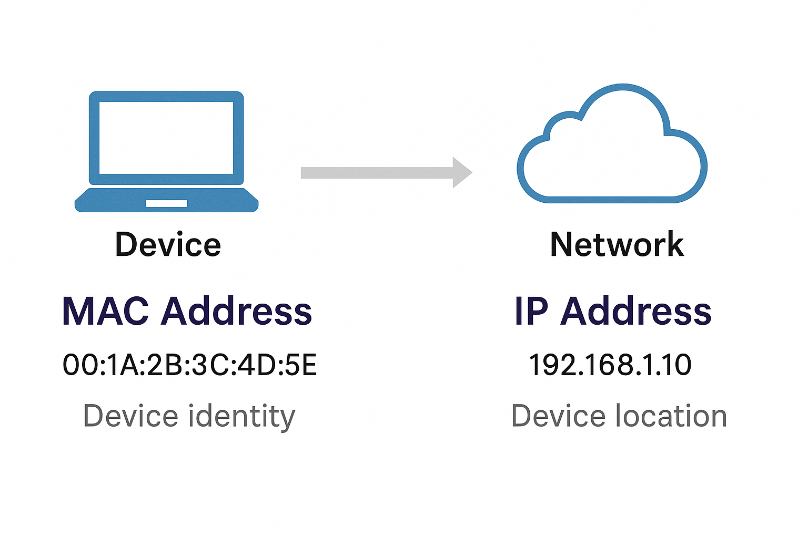

# Networking Basics & Key Terminology
~
## Written By: VINOD N. RATHOD.
~

## MAC Address (Layer 2 Hardware Address)  

### What is a MAC Address?  
- **Definition:** A MAC (Media Access Control) Address is a unique hardware identifier assigned to a device’s network interface card (NIC).  
- **Layer:** Works at Data Link Layer (Layer 2) of the OSI model.  
- **Format:**  
  - 48-bit (6 bytes) long.  
  - Usually written in hexadecimal (e.g., 00:1A:2B:3C:4D:5E).  
- **Uniqueness:** No two devices in the world should have the same MAC address.  

---

### Why is it Important?  
- Ensures devices on the same local network can be uniquely identified.  
- Used by switches to send data to the correct destination device.  
- Provides hardware-level addressing (different from IP, which is logical/software-based).  

---

### MAC Address vs. IP Address  
- **MAC Address:** Fixed, tied to the device’s hardware (permanent, unless spoofed).  
- **IP Address:** Logical, assigned by the network (can change depending on network).  
- **Example:**  
  - MAC = Device’s permanent ID (like a fingerprint).  
  - IP = Device’s current location/address in the network.  

---

### Examples of Use  
- When you connect your laptop to Wi-Fi, the router uses your MAC address to allow or block access.  
- Switches in a LAN use MAC addresses to forward data only to the intended device.  
- MAC filtering can be used for network security (only specific devices allowed).  

---

---

## Key Points (Quick Reference)  
- **MAC** = Unique hardware address of a device.  
- **Length** = 48-bit, written in hexadecimal.  
- **Layer** = Data Link Layer (Layer 2).  
- **Permanent** (hardware-based), unlike IP which is logical and changeable.  

---
# THANK YOU!  
# ~ **V1NNN22** ~
