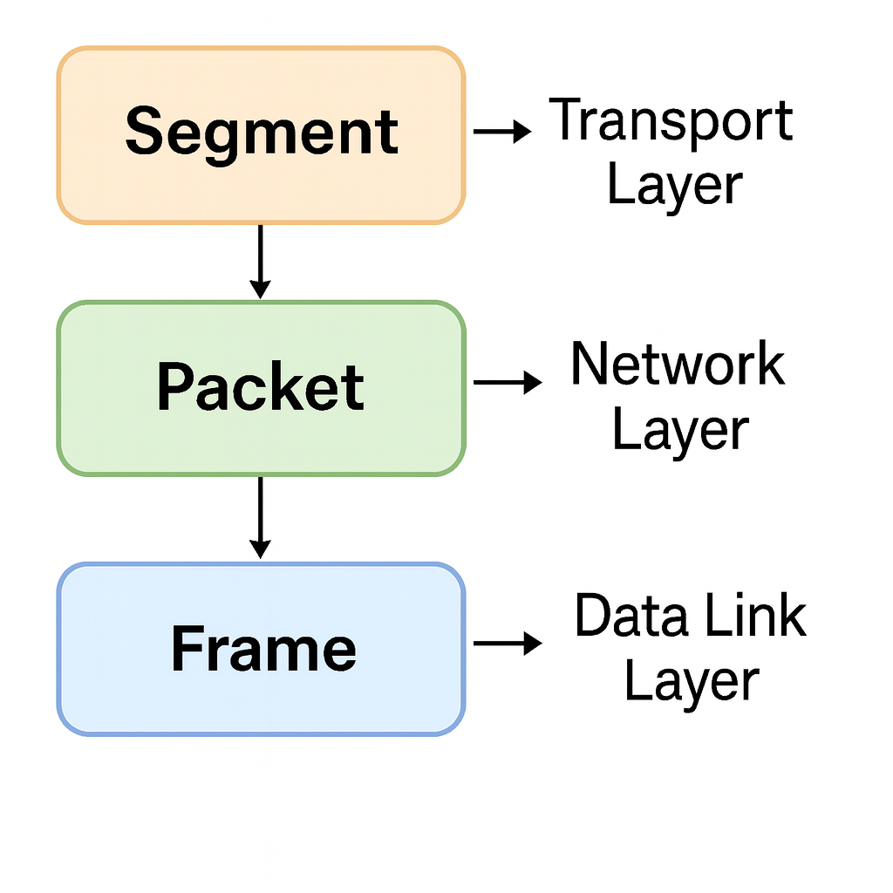

# Networking Basics & Key Terminology
~
## Written By: VINOD .N. RATHOD.
~

## Packets, Frames, Segments, Datagrams

When data is sent over a network, it cannot travel as one big block. Instead, it is broken into smaller units for easier, faster, and safer transmission. These units have different names depending on the layer of the OSI model they belong to.

---

### Segments
- **Definition:** A segment is the unit of data at the Transport Layer (Layer 4 of OSI).  
- **Purpose:** It ensures reliable delivery of data between applications on different devices.  
- **Details:**  
  - If using **TCP (Transmission Control Protocol):** The data is called a segment. TCP adds extra info like sequence numbers, acknowledgments, and error-checking to guarantee correct delivery.  
  - If using **UDP (User Datagram Protocol):** The data is called a datagram (explained below).  
- **Example:** When you send an email, TCP breaks the message into multiple segments to ensure each part arrives in the right order.  
- **Key Point:** Segments = Data chunks created at the transport layer.  

---

### Packets
- **Definition:** A packet is the unit of data at the Network Layer (Layer 3).  
- **Purpose:** It is responsible for addressing and delivering data across networks.  
- **Details:**  
  - Each packet contains a source IP address and a destination IP address so routers know where to send it.  
  - Packets can take different routes through the internet, and the receiving system reassembles them.  
- **Example:** When you open a website, your request is sent in packets containing your computer’s IP and the server’s IP.  
- **Key Point:** Packets = Segments with IP addresses, ready for routing across networks.  

---

### Frames
- **Definition:** A frame is the unit of data at the Data Link Layer (Layer 2).  
- **Purpose:** It defines how data is physically placed on the network medium (cables or wireless signals).  
- **Details:**  
  - Frames include MAC addresses (hardware addresses of network cards) so devices on the same network can talk directly.  
  - Frames also contain error detection bits (CRC) to check if the data was corrupted in transit.  
- **Example:** In a home network, your laptop’s network card sends data as frames to your Wi-Fi router using MAC addresses.  
- **Key Point:** Frames = Packets with MAC addresses, ready for delivery on the physical network.  

---

### Datagrams
- **Definition:** A datagram is similar to a segment but specifically refers to data sent using UDP at the Transport Layer.  
- **Purpose:** It is used when speed is more important than reliability (no guarantee of delivery, ordering, or error correction).  
- **Details:**  
  - Unlike TCP segments, datagrams are “fire-and-forget.”  
  - They are faster but less reliable, making them ideal for streaming and real-time applications.  
- **Example:** Online games, live video streaming, or VoIP calls use UDP datagrams.  
- **Key Point:** Datagrams = Lightweight transport units using UDP (fast but no guarantee).  

---

## Quick Reference (Layer-Wise)
- **Segment** → Transport Layer (TCP) unit of data  
- **Datagram** → Transport Layer (UDP) unit of data  
- **Packet** → Network Layer unit of data (IP addresses added)  
- **Frame** → Data Link Layer unit of data (MAC addresses + error checking added)  

---

----

## Difference Between them
- **Segment** → Data at the Transport Layer (TCP).  
  Think of it as a piece of a message that TCP keeps track of (with numbers, acknowledgments, etc.).  
- **Datagram** → Data at the Transport Layer (UDP).  
  Same as a segment, but with UDP — fast and simple, no guarantees of delivery.  
- **Packet** → Data at the Network Layer (IP).  
  This is when IP addresses (source & destination) are added so the data knows where it’s going.  
- **Frame** → Data at the Data Link Layer (MAC/Physical).  
  This is when the actual hardware (MAC) addresses and error-checking are added so it can physically travel on cables or Wi-Fi.  

---

## In short
- **Segment/Datagram** = Transport layer units (with TCP or UDP).  
- **Packet** = Network layer unit (adds IP addresses).  
- **Frame** = Data Link layer unit (adds MAC addresses + error check).  

---
# THANK YOU!  
# ~ **V1NNN22** ~
