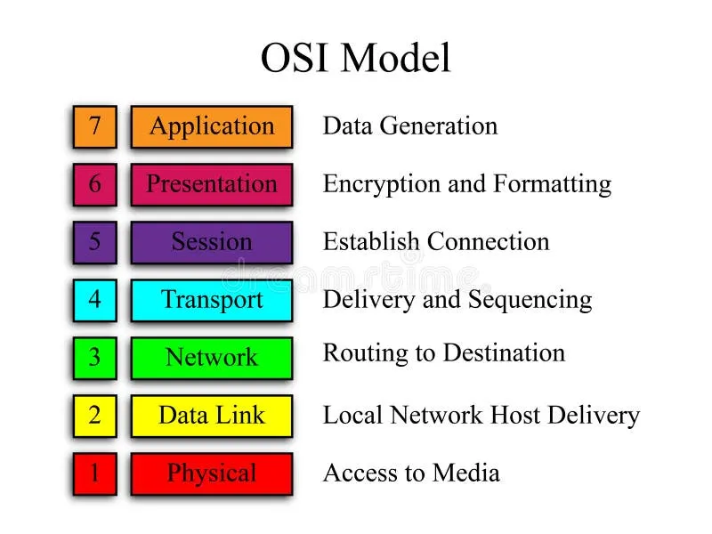

# OSI Model (Open Systems Interconnection)  
~
## Written By: VINOD N. RATHOD.  
~

## What is the OSI Model?  
- **Definition:** A conceptual framework that standardizes how different networking devices communicate over a network.  
- **Purpose:** Breaks down networking into 7 layers, each with a specific role → helps in troubleshooting, designing, and understanding networks.  
- **Analogy:** Like a postal system, where each step (writing → packing → addressing → delivering) represents a layer.  

---

## The 7 Layers of OSI Model  

### 1. Physical Layer (Layer 1)  
- **Function:** Deals with hardware transmission of raw bits over a medium.  
- **Role:** Cables, switches, voltage, signals.  
- **Examples:** Ethernet cables, Fiber optics.  

---

### 2. Data Link Layer (Layer 2)  
- **Function:** Provides node-to-node communication and handles MAC addresses.  
- **Role:** Error detection/correction, framing.  
- **Examples:** Switches, Ethernet (MAC), ARP.  

---

### 3. Network Layer (Layer 3)  
- **Function:** Handles logical addressing & routing of data.  
- **Role:** Determines the best path for data packets.  
- **Examples:** Routers, IP addresses (IPv4/IPv6).  

---

### 4. Transport Layer (Layer 4)  
- **Function:** Provides end-to-end communication and error recovery.  
- **Role:** Segmentation, flow control, reliability.  
- **Examples:** TCP, UDP, Port numbers.  

---

### 5. Session Layer (Layer 5)  
- **Function:** Manages sessions (connections) between applications.  
- **Role:** Establish, maintain, and terminate connections.  
- **Examples:** Remote login sessions, APIs.  

---

### 6. Presentation Layer (Layer 6)  
- **Function:** Translates data into a format usable by applications.  
- **Role:** Encryption, compression, data translation.  
- **Examples:** SSL/TLS, JPEG, MP3.  

---

### 7. Application Layer (Layer 7)  
- **Function:** Closest to the end-user. Provides network services to applications.  
- **Role:** Interface for software to communicate over the network.  
- **Examples:** HTTP, FTP, SMTP, DNS.  

---

## Quick Recap (Mnemonic)  
- **All People Seem To Need Data Processing**  
  - **Application → Presentation → Session → Transport → Network → Data Link → Physical**  

---

  

---

# THANK YOU!  
# ~ **V1NNN22**  
